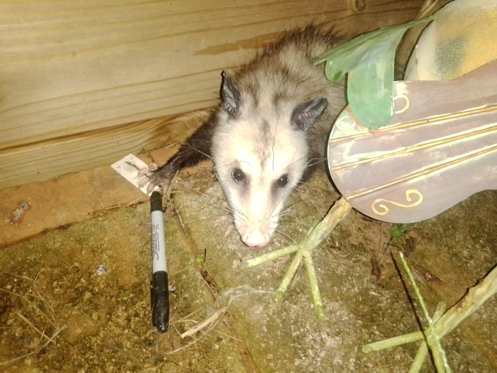

# What's aye-aye?

Aye-aye is a chrome extension the helps you binge on indie web webring pages.

*(this **isn't** an aye-aye, just the creature the author of this repository identifies with)*

# How to install?

1. In chrome, go to: [chrome:extensions](chrome:extensions)
2. Select _Install unpacked extension_
3. Select the `dist` folder of this repository

# How to update?

1. Download the current release
2. Unzip it
3. Copy the contents of the ZIP file to the folder where the current version is installed. 

> [!NOTE]
> Important: don't remove or replace the folder where the extension is installed, just copy the contents of the ZIP file to the folder. This is important because otherwise Chrome might lose your settings, such as previously selected links.

Why? When you load an unpacked extension from a new folder, Chrome will treat it as a *new* extension, thus dropping all of your stored settings. We don't support Chrome Web Store as of yet, and Google has made it much harder to sign and distribute extensions without manual work. 

It's annoying, I know, please enjoy this complimentary hedgehog:

# How to release?

`$ npm version <patch|minor|major>`
`$ git push --tags`